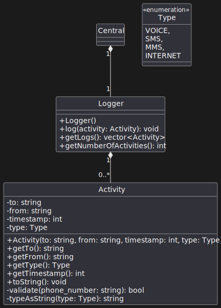

# Lesson 10 Exercises

The Danish government has ordered all Telecommunication Service Providers (TSPs) to log activity on their networks. In Denmark, there are four main TSPs: TDC, Telenor, Telia, and Hi3G.

The collected data is part of what is commonly referred to as teledata. The police can request access to specific parts of this data — for example, information about certain phone numbers or radio towers — but only if a judge approves a warrant.

In this exercise, you will implement a simplified version of a TSP logging system.

### Exercise 0x00 – Create a Class Diagram for `Central`

Create a UML class diagram that shows the structure of the Central class and its relationships to other classes.

```cpp
#include <vector>
#include "logger.h"

class Central {
public:
  Central();
  Central(Logger);
  void log(Activity *activity); 
  void printLog();
  Logger getLogger();
  void setLogger(Logger logger);
private:
  Logger logger;
};
```

> **Hint** 
> 
> _If the class uses composition (i.e., it contains other classes like Logger or Activity), just include those as empty classes in your diagram for now — no need to add attributes or methods to them yet._

### Exercise 0x01 — From diagram to code

Now that you have created a UML diagram for the TeleCentral system, it's time to start turning parts of that diagram into actual C++ code.

Based on the UML diagram below:



Implement the following in C++:
- The `Logger` class
- The `Activity` class
- The `Type` enum

> **_Reflection_**
> 
> _As you work on this, take a moment to think about the relationships shown in the UML diagram:_
> - _What do the cardinalities (the numbers next to the lines between classes) tell you about how the classes are connected?_
> - _Write down your thoughts or discuss them with your group._

Now that we have an UML representation of the `TeleCentral` class, it's time to implement some classes defined in UML.

## Exercise 0x10 — Testing our implementation
Now it's time to check that everything is working according to spec. Implement a program (a `main()` function) and use add the test data to your project (available on Brightspace in a header file `activity-log.h`) to test your classes.

```cpp
#include <iostream>
#include "central.h"
#include "data-log.h"

using namespace std;

int main (int argc, char* argv[]) {

  Central c = Central();
  for(Activity a : DATA) {
    c.log(&a);
  }
  c.printLog();

  return 0;
}
```

## Exercise 0x20 — Filtering
Now it's time to implement some additional business logic in our classes.

Start by adding the header and implementation file for the `DateTime` class into your project (they're available on Brightspace). The class is a simple wrapper around a standard library, that allows to print Unix timestamps in a human-readable format.

Add a new function to called `filter(int from, int to)` to the `Logger` class (and remember to update your diagrams) that iterates (I'll recommend a `for`-loop) over all messages and prints out activities whose timestamps are within the period as defined by `from` and `to`. Use the `DateTime` class to convert the integer value to a datetime string.

##### Example output, where `from` is 1711936658 and `to` is 1712331675 
```
2024-04-01 01:57:38     1711936658      65247015                        INTERNET
2024-04-01 08:03:24     1711958604      58734886        43331556        SMS
2024-04-01 11:07:54     1711969674      41374330        68746784        VOICE
2024-04-01 20:12:42     1712002362      68962561        33589049        MMS
2024-04-03 06:56:59     1712127419      57494309        62953240        VOICE
2024-04-03 15:12:01     1712157121      64692447                        INTERNET
2024-04-05 15:41:15     1712331675      42413862        68937678        SMS
```

Can you up any other filter methods to add? Try to implement some of these:
- `filter(int from, int to, Type type)`
- `filter(int from, int to, Type type, int count)`